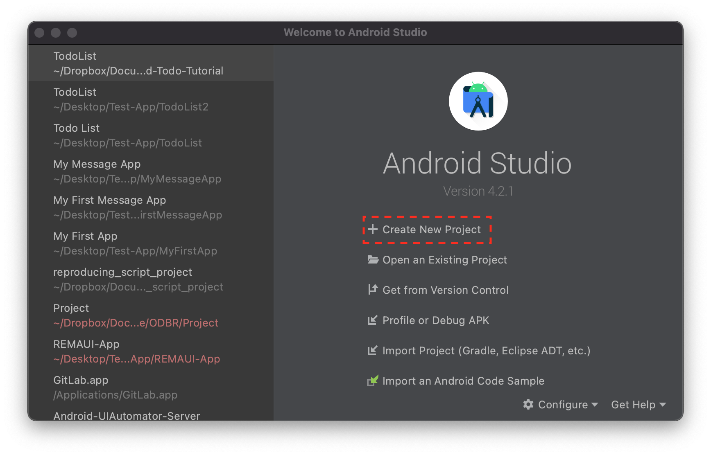
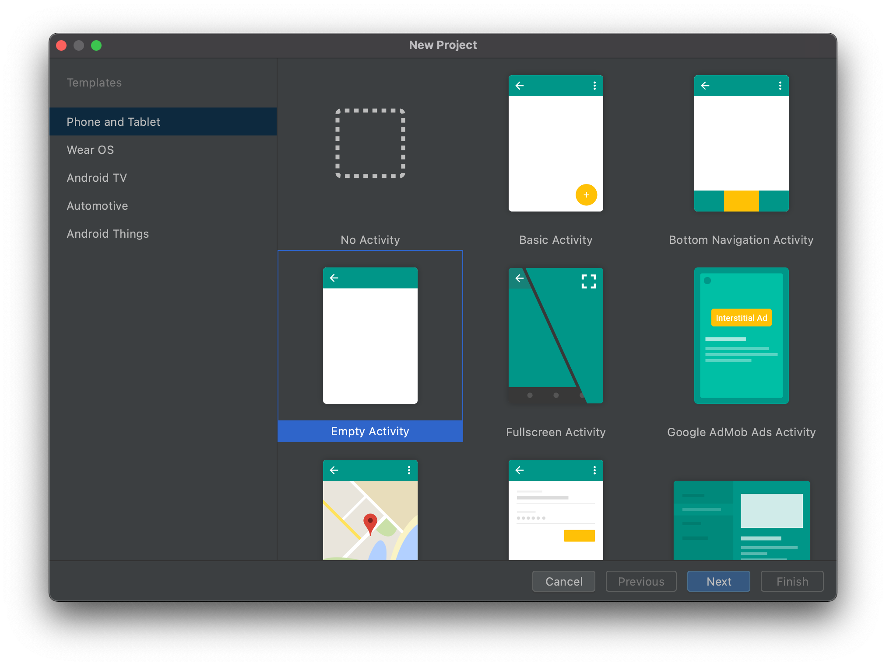
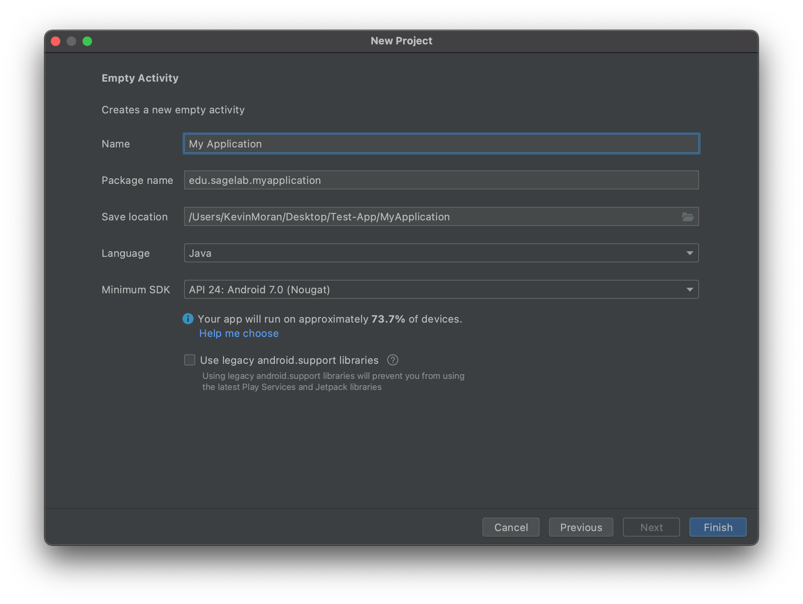
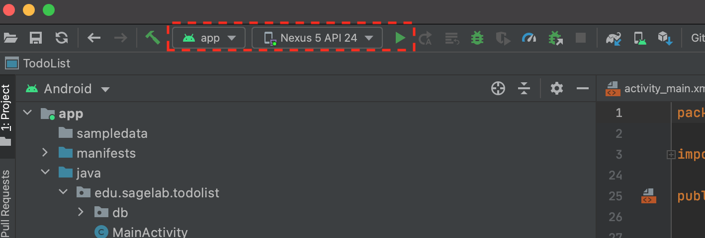
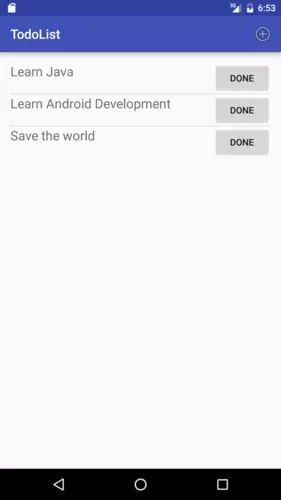

<head>
<link rel="preconnect" href="https://fonts.gstatic.com"> 
<link href="https://fonts.googleapis.com/css2?family=Roboto:ital,wght@0,100;0,300;0,400;0,500;0,700;0,900;1,100;1,300;1,400;1,500;1,700;1,900&display=swap" rel="stylesheet">
</head>

<style>
@font-face {
  font-family: 'Roboto', sans-serif;
}
</style>

## Getting Started

Please follow these instructions before the tutorial begins to install [Android Studio](https://developer.android.com/studio) (the integrated development environment, or IDE, for building Android Apps) and configure an Android emulator (a virtual device that will allow you to run and test your prototype application).

### Installing Android Studio

Please visit [https://developer.android.com/studio](https://developer.android.com/studio) in order to download the version of Android studio for the operating system that you use. All major operating systems, including macOS, Windows, and most flavors of Linux are supported.

Follow the instructions for your specific operating system to finish the installation. You can find a detailed guide for specific operating systems [here](https://developer.android.com/studio/install).

### Configuring Your Android Emulator

Once you have installed Android studio, either navigate to the launch screen view or the code editor view in order to launch the **AVD Manager**. See the screenshots below to see the steps involved in doing this.

 1. First click on the "Configure" button at the bottom of the splash screen.

{ align=left }2. Click on the "AVD Manager" option to launch the configurator for the virtual Android Devices. 


 3. Click on the "+ Create Virtual Device" button to launch the configurator wizard.


 4. The first screen of the configurator wizard allows you to pick the hardware settings of your virtual Android device. This includes attributes such as the device screen size and pixel density. For the purposes of this tutorial, we will be using the Nexus 5 emulator, which you can select by scrolling to and clicking on the hardware configuration as shown in the above screenshot. After you have selected the Nexus 5 profile, you can click the "Next" button.


 5. Next we need to configure the software that our Android emulator will run on. The wizard allows you to select from many different Android versions, some of which contain proprietary Google Play APIs. For the purposes of this tutorial, we will be using Android 7.0 (also called Nougat) as it has good compatibility across a range of Android devices. To use this version, you first click on the Download button, to download the software image. After the download is complete, you can then select the software version in the configuration wizard and click the "Next" button.


 6. The Final screen of the configuration wizard provides some more advanced options and provides general information about the device you configured. For the purposes of this tutorial, we do not need to worry about advanced options, so you can simply click on the "Finish" button.


 7. Now that your Android emulator has been configured, you can launch the emulator by clicking on the green "play button as indicated above. This should launch your emulator and allow you to test applications! 

--- 

## Getting Help

If you have trouble or need help, please reach out to Dr. Moran on the `android-tutorial` channel in the [REU Slack](https://edm-reu-mason-2021.slack.com), or the [NRT Slack Channel](https://casbbinrt2021.slack.com). He will be happy to assist you!

---

## Tutorial: Developing a ToDo List App

Today, you will be developing a To-Do List application for Android using the Java programming language. While, as discussed in the lecture, Android does support Kotlin, most of you are likely more familiar with Java and it is still supported :-) I have already coded this project and placed it on GitHub, which you can access via the button below. However, you should use this only if you get stuck, otherwise, follow the tutorial below, as it will teach you about the purpose of the code.

<div style="text-align: center;">
<a href="https://github.com/SageSELab/Android-Todo-Tutorial" title="Click here to Access the GitHub project" class="md-button md-button--primary">Click Here to Access the GitHub project</a>
</div>

!!! note
    This tutorial is adapted and updated from Aldo Ziflaj's awesome tutorial, which you can find [here](https://www.sitepoint.com/starting-android-development-creating-todo-app/) (but the code and structure is a bit outdated).
    

### Step 1: Create a New Android Studio Project



Open the AndroidStudio launch screen and select the "Create New Project" button.



Next select the "Empty Activity" and then click "Next".



On the next screen, you can configure the general project attributes. First, choose a suitable name for your TodoList project. You can use any name you like. Next, provide a package name. If you are not sure what to use, you can use `edu.gmu.<project-name>`. Next, select the location where you want the code to be stored on your computer hard-disk. After that, make sure that the selected Language is `Java` as we will be using Java for this tutorial. Next, set the minimum SDK to `API 24: Android 7.0 (Nougat)`. Make sure the "Use legacy android.support libraries is *unchecked*. Finally, click the "Finish" button to create your project!



Next, let's make sure your app can run! Once Android Studio finishes automatically setting up the new project, you can click on the green arrow in the menu bar to run your app. This should launch your configured emulator and launch the app!


### Step 2: Setting up the UI

In the `MainActivity.java` class, you should see something like the code below:

``` java linenums="1"
public class MainActivity extends AppCompatActivity {

    @Override
    protected void onCreate(Bundle savedInstanceState) {
        super.onCreate(savedInstanceState);
        setContentView(R.layout.activity_main);
    }
}
```

On line 11, you set the view of this activity to `R.layout.activity_main`, which points to a file called `activity_main.xml` in the `/res/layout` directory of the project. To view the layout, select the `activity_main.xml` file from under the `res/layout` folder and double click it. This will bring out the layout inspector. However, we will be using the xml code to build this UI. To view the xml code, click on the "Code" button in the top left of the LayoutInspector. You will then see a A vie, that controls layout of the Android interface, that looks like this:

``` xml linenums="1"
<?xml version="1.0" encoding="utf-8"?>
<RelativeLayout xmlns:android="http://schemas.android.com/apk/res/android"
    xmlns:tools="http://schemas.android.com/tools"
    android:layout_width="match_parent"
    android:layout_height="match_parent"
    android:paddingBottom="@dimen/activity_vertical_margin"
    android:paddingLeft="@dimen/activity_horizontal_margin"
    android:paddingRight="@dimen/activity_horizontal_margin"
    android:paddingTop="@dimen/activity_vertical_margin"
    tools:context="com.aziflaj.todolist.MainActivity">

    <TextView
        android:layout_width="wrap_content"
        android:layout_height="wrap_content"
        android:text="Hello World!" />
</RelativeLayout>
```

In the `main` view, you will add a `ListView`, which will contain a ToDo item in each row. To do this, replace the `TextView` element with the code below:

``` xml linenums="1"
<ListView
        android:id="@+id/list_todo"
        android:layout_width="wrap_content"
        android:layout_height="wrap_content"
        app:layout_constraintBottom_toBottomOf="parent"
        app:layout_constraintLeft_toLeftOf="parent"
        app:layout_constraintRight_toRightOf="parent"
        app:layout_constraintTop_toTopOf="parent" />
```

Now you will define a list item, which will represent a task in the interface.

Create a new layout file in the `/res/layout` folder called `item_todo.xml`. You can do this by right clicking on the `layout` directory under the `res` directory and selecting the "New Layout Resource File" option.


You will add two elements to this file, a `TextView` to show the task, and a “Done” `Button` to delete the task. Add this code to `item_todo.xml`, replacing anything that is already there.

``` xml linenums="1"
<?xml version="1.0" encoding="utf-8"?>
<androidx.constraintlayout.widget.ConstraintLayout xmlns:android="http://schemas.android.com/apk/res/android"
    android:layout_width="match_parent"
    android:layout_height="match_parent">

    <RelativeLayout xmlns:android="http://schemas.android.com/apk/res/android"
        android:layout_width="match_parent"
        android:layout_height="match_parent"
        android:layout_gravity="center_vertical">

        <TextView
            android:id="@+id/task_title"
            android:layout_width="wrap_content"
            android:layout_height="wrap_content"
            android:layout_alignParentLeft="true"
            android:layout_alignParentStart="true"
            android:text="Hello"
            android:textSize="20sp" />

        <Button
            android:id="@+id/task_delete"
            android:layout_width="wrap_content"
            android:layout_height="wrap_content"
            android:layout_alignParentEnd="true"
            android:layout_alignParentRight="true"
            android:text="Done"/>

    </RelativeLayout>

</androidx.constraintlayout.widget.ConstraintLayout>
```

The app needs a menu item to allow user to add more tasks. Add a `main_menu.xml` file in the `/res/menu` directory, following the same procedure as above. The only difference is you will first create a `menu` directory under the `res` directory and right click the `res/menu` directory to add the Layout resource. Once you have created the `main_menu.xml` layout, double click it to open it, switch to the Code view by clicking the button in the top right, and replace your code with the following:

``` xml linenums="1"
<?xml version="1.0" encoding="utf-8"?>

    <menu xmlns:android="http://schemas.android.com/apk/res/android"
        xmlns:app="http://schemas.android.com/apk/res-auto">
        <item
            android:id="@+id/action_add_task"
            android:icon="@android:drawable/ic_menu_add"
            android:title="Add Task"
            app:showAsAction="always" />
    </menu>
```

Next, we need to connect this static UI code to the main cod logic of the app. To do this, you should add the following information to your `MainActivity.java` file, after the `onCreate` method.

``` java linenums="1"
@Override
public boolean onCreateOptionsMenu(Menu menu) {
    getMenuInflater().inflate(R.menu.main_menu, menu);
    return super.onCreateOptionsMenu(menu);
}

@Override
public boolean onOptionsItemSelected(MenuItem item) {
    switch (item.getItemId()) {
        case R.id.action_add_task:
            Log.d(TAG, "Add a new task");
            return true;

        default:
            return super.onOptionsItemSelected(item);
    }
}
```

!!! note
    You might have some errors related to `imports` when you copy and paste code throughout this tutorial. To resolve these, simply hover your mouse over the red-underlined text, and then click on `import class`. This will add an `import` statement to the top of the class so that the code can properly utilize the referenced library class.

You will likely have an error after this relating to a `TAG` constant. To resolve this error, add the following line to the beginning of the `MainActivity` class: 

``` java linenums="1"
@Override
public boolean onCreateOptionsMenu(Menu menu) {
    getMenuInflater().inflate(R.menu.main_menu, menu);
    return super.onCreateOptionsMenu(menu);
}

@Override
public class MainActivity extends AppCompatActivity {
    private static final String TAG = "MainActivity";
...
```

The `onCreateOptionsMenu()` method inflates (renders) the menu in the main activity, and uses the `onOptionsItemSelected()` method to react to different user interactions with the menu item(s). If you run the application, it should look something like this:


If you click the add button, you will see something like this in the Android Studio log:

`03-26 22:12:50.327 2549-2549/? D/MainActivity: Add a new task`

Next, you will add an AlertDialog to get the task from the user when the add item button is clicked. You already know where to add the code to react to the user, so replace the logging statement in the `MainActivity` (depicted below)

``` java linenums="1"
Log.d(TAG, "Add a new task");
```

with the following code snippet:

``` java linenums="1"
final EditText taskEditText = new EditText(this);
AlertDialog dialog = new AlertDialog.Builder(this)
        .setTitle("Add a new task")
        .setMessage("What do you want to do next?")
        .setView(taskEditText)
        .setPositiveButton("Add", new DialogInterface.OnClickListener() {
            @Override
            public void onClick(DialogInterface dialog, int which) {
                String task = String.valueOf(taskEditText.getText());
                Log.d(TAG, "Task to add: " + task);
            }
        })
        .setNegativeButton("Cancel", null)
        .create();
dialog.show();
```

Now if you launch your app again, clicking the plus button should give you this:


Enter some text and when you click the add button, the Android Studio log (“logcat”) will show something like this:

`03-26 23:32:18.294 12549-12549/? D/MainActivity: Task to add: I want to learn Android Development`

---

### Step 3: Storing and Retrieving Data

Android ships with an embedded `SQLite` database. The database needs a table before it can store any tasks, which we will call the “TaskTable”. Create a new `db` package in the same location as MainActivity.java by click on the package path (e.g., `edu.gmu.<your-app.`, select "New Package" and then call it `db`. Then create a new class called `TaskContract` with the file name TaskContract.java by right click on the db folder and selecting "New Java Class".

Add this code to TaskContract.java, beneath the package declaration.

``` java linenums="1"
import android.provider.BaseColumns;

public class TaskContract {
    public static final String DB_NAME = "com.aziflaj.todolist.db";
    public static final int DB_VERSION = 1;

    public class TaskEntry implements BaseColumns {
        public static final String TABLE = "tasks";

        public static final String COL_TASK_TITLE = "title";
    }
}
```


The `TaskContract` class defines constants which used to access the data in the database. You also need a helper class called `TaskDbHelper` to open the database. Create this class in the `db` package (following the same method as above) and add the following code:

``` java linenums="1"
   public class TaskDbHelper extends SQLiteOpenHelper {
   
   public TaskDbHelper(Context context) {
        super(context, TaskContract.DB_NAME, null, TaskContract.DB_VERSION);
    }

    @Override
    public void onCreate(SQLiteDatabase db) {
        String createTable = "CREATE TABLE " + TaskContract.TaskEntry.TABLE + " ( " +
                TaskContract.TaskEntry._ID + " INTEGER PRIMARY KEY AUTOINCREMENT, " +
                TaskContract.TaskEntry.COL_TASK_TITLE + " TEXT NOT NULL);";

        db.execSQL(createTable);
    }

    @Override
    public void onUpgrade(SQLiteDatabase db, int oldVersion, int newVersion) {
        db.execSQL("DROP TABLE IF EXISTS " + TaskContract.TaskEntry.TABLE);
        onCreate(db);
    }
}
```

Now we need to adapt `MainActivity` to store data in the database. Add this code where you defined the `DialogInterface.OnClickListener()` for the AlertDialog‘s add button, replacing:

``` java linenums="1"
String task = String.valueOf(taskEditText.getText());
Log.d(TAG, "Task to add: " + task);
```

with: 

``` java linenums="1"
String task = String.valueOf(taskEditText.getText());
                                SQLiteDatabase db = mHelper.getWritableDatabase();
                                ContentValues values = new ContentValues();
                                values.put(TaskContract.TaskEntry.COL_TASK_TITLE, task);
                                db.insertWithOnConflict(TaskContract.TaskEntry.TABLE,
                                        null,
                                        values,
                                        SQLiteDatabase.CONFLICT_REPLACE);
                                db.close();
```

This makes the whole `onOptionsItemSelected()` method look like:

``` java linenums="1"
@Override
public boolean onOptionsItemSelected(MenuItem item) {
    switch (item.getItemId()) {
        case R.id.action_add_task:
            final EditText taskEditText = new EditText(this);
            AlertDialog dialog = new AlertDialog.Builder(this)
                    .setTitle("Add a new task")
                    .setMessage("What do you want to do next?")
                    .setView(taskEditText)
                    .setPositiveButton("Add", new DialogInterface.OnClickListener() {
                        @Override
                        public void onClick(DialogInterface dialog, int which) {
                            String task = String.valueOf(taskEditText.getText());
                            SQLiteDatabase db = mHelper.getWritableDatabase();
                            ContentValues values = new ContentValues();
                            values.put(TaskContract.TaskEntry.COL_TASK_TITLE, task);
                            db.insertWithOnConflict(TaskContract.TaskEntry.TABLE,
                                    null,
                                    values,
                                    SQLiteDatabase.CONFLICT_REPLACE);
                            db.close();
                        }
                    })
                    .setNegativeButton("Cancel", null)
                    .create();
            dialog.show();
            return true;

        default:
            return super.onOptionsItemSelected(item);
    }
}
```

Next, add a private instance of `TaskDbHelper` in the MainActivity class, directly underneath where we had the tag before:

``` java linenums="1"
public class MainActivity extends AppCompatActivity {
    private static final String TAG = "MainActivity";
    private TaskDbHelper mHelper;
```

And initialize it in the onCreate() method:

``` java linenums="1"
protected void onCreate(Bundle savedInstanceState) {
        super.onCreate(savedInstanceState);
        setContentView(R.layout.activity_main);

        mHelper = new TaskDbHelper(this);
        
    }
```

Now we need to fetch all the data from the database and show it in the main view. Get a reference to the ListView created in activity_main.xml file by adding an instance of the ListView:

``` java linenums="1"
public class MainActivity extends AppCompatActivity {
    private static final String TAG = "MainActivity";
    private TaskDbHelper mHelper;
```

And initialize it in the onCreate() method:

``` java linenums="1"
public class MainActivity extends AppCompatActivity {
    private static final String TAG = "MainActivity";
    private TaskDbHelper mHelper;
    private ListView mTaskListView;
```

Initialize the reference by adding this line of code to the `onCreate()` method, right after creating `mHelper`:

``` java linenums="1"
    protected void onCreate(Bundle savedInstanceState) {
        super.onCreate(savedInstanceState);
        setContentView(R.layout.activity_main);

        mHelper = new TaskDbHelper(this);
        mTaskListView = (ListView) findViewById(R.id.list_todo);
```

Next we are going to add a method that handles updating the UI. To do this, add the following method in your `MainActivity` class:

``` java linenums="1"
    private void updateUI() {
        ArrayList<String> taskList = new ArrayList<>();
        SQLiteDatabase db = mHelper.getReadableDatabase();
        Cursor cursor = db.query(TaskContract.TaskEntry.TABLE,
                new String[]{TaskContract.TaskEntry._ID, TaskContract.TaskEntry.COL_TASK_TITLE},
                null, null, null, null, null);
        while (cursor.moveToNext()) {
            int idx = cursor.getColumnIndex(TaskContract.TaskEntry.COL_TASK_TITLE);
            taskList.add(cursor.getString(idx));
        }

        if (mAdapter == null) {
            mAdapter = new ArrayAdapter<>(this,
                    R.layout.item_todo,
                    R.id.task_title,
                    taskList);
            mTaskListView.setAdapter(mAdapter);
        } else {
            mAdapter.clear();
            mAdapter.addAll(taskList);
            mAdapter.notifyDataSetChanged();
        }

        cursor.close();
        db.close();
    }
```

Add a private `ArrayAdatper` field to the `MainActivity` class:

``` java linenums="1"
public class MainActivity extends AppCompatActivity {
    private static final String TAG = "MainActivity";
    private TaskDbHelper mHelper;
    private ListView mTaskListView;
    private ArrayAdapter<String> mAdapter;
```

This `ArrayAdapter` will help populate the ListView with the data.

If you don’t understand the `updateUI()` method, that’s OK. Instead of logging the tasks, add them into an `ArrayList` of Strings. It then checks if `mAdapter` is created or not. If it isn’t, and `mAdapter` is null, create and set it as the adapter of the `ListView` (see below code you already have):

``` java linenums="1"
mAdapter = new ArrayAdapter<>(this,
        R.layout.item_todo, // what view to use for the items
        R.id.task_title, // where to put the String of data
        taskList); // where to get all the data

mTaskListView.setAdapter(mAdapter); // set it as the adapter of the ListView instance
```

If the adapter is already created (which implies that it’s assigned to the `ListView`), clear it, re-populate it and notify the view that the data has changed. This means that the view will repaint on the screen with the new data.

To see the updated data, you need to call the `updateUI()` method every time the underlying data of the app changes. So, add it in two places:

*  In the onCreate() method, that initially shows all the data
*  After adding a new task using the AlertDialog

See the two code snippets below for where `updateUI()` should be added:

``` java linenums="1"
protected void onCreate(Bundle savedInstanceState) {
        super.onCreate(savedInstanceState);
        setContentView(R.layout.activity_main);

        mHelper = new TaskDbHelper(this);
        mTaskListView = (ListView) findViewById(R.id.list_todo);

        updateUI();
    }
```

``` java linenums="1"
public void onClick(DialogInterface dialog, int which) {
                                String task = String.valueOf(taskEditText.getText());
                                SQLiteDatabase db = mHelper.getWritableDatabase();
                                ContentValues values = new ContentValues();
                                values.put(TaskContract.TaskEntry.COL_TASK_TITLE, task);
                                db.insertWithOnConflict(TaskContract.TaskEntry.TABLE,
                                        null,
                                        values,
                                        SQLiteDatabase.CONFLICT_REPLACE);
                                db.close();
                                updateUI();
```

---

### Step 4: Deleting Tasks

After finishing a task, it should be deleted from the list.

Open the `item_todo.xml` layout and add this line to the `Button` tag:

``` xml linenums="1"
        <Button
            android:id="@+id/task_delete"
            android:layout_width="wrap_content"
            android:layout_height="wrap_content"
            android:layout_alignParentEnd="true"
            android:layout_alignParentRight="true"
            android:text="Done"
            android:onClick="deleteTask"/>
```

When the button is clicked, it calls this method `deleteTask()` in the MainActivity class, which you should now add:

``` java linenums="1"
    public void deleteTask(View view) {
        View parent = (View) view.getParent();
        TextView taskTextView = (TextView) parent.findViewById(R.id.task_title);
        String task = String.valueOf(taskTextView.getText());
        SQLiteDatabase db = mHelper.getWritableDatabase();
        db.delete(TaskContract.TaskEntry.TABLE,
                TaskContract.TaskEntry.COL_TASK_TITLE + " = ?",
                new String[]{task});
        db.close();
        updateUI();
    }
```

Now, clicking the `Done` button will delete the task from the list and the SQLite database!

Now run your app to test it out! You should see functionality similar to that indicated below:



---

### Final Step: Congratulations!

Congrats on Building your first Android app. This app demonstrates some important features of Android, such as how to set up a UI View, how to connect different components together, and how to store data from an application.

If you made this far and you want to explore more, check out the Bonus Tasks you can try below. These tasks have much less direction, and expect that you will look up some information on your own.

---

### Bonus Task 1: Change the Look and Feel of the UI

For this bonus task, you should use the `LayoutInspector` to change the look and feel of the UI. For example, try to set the theme to GMU colors, and explore different fonts or layout configurations for the tasks!

---

### Bonus Task 2: Add Due Dates

For this Bonus Task, we are challenging you to add due dates to the ToDo list app. This will require modifying the `AlertDialog` the `database` and the `item_todo` layout resource file. Check out the following [resource](https://www.tutlane.com/tutorial/android/android-datepicker-with-examples) on how to use the `DatePicker` component.  

---

### Bonus Task 3: Allow Tasks with Images

For this Bonus Task, you should modify the Tasks so that the user can add an image to them, in case they need to reference it later. For this task, check out this [SO post](https://stackoverflow.com/questions/38352148/get-image-from-the-gallery-and-show-in-imageview) that provides some direction on how to get started with this.