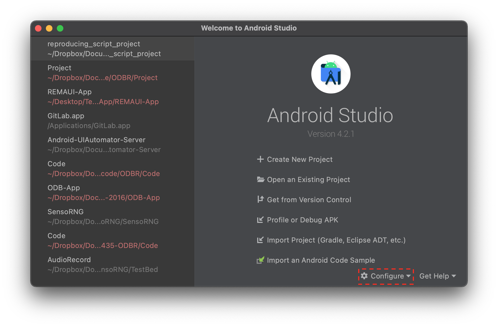
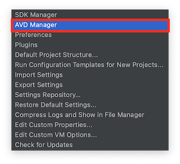
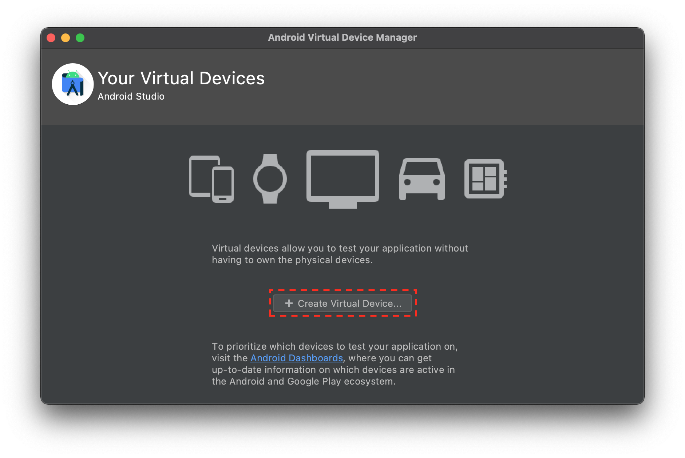
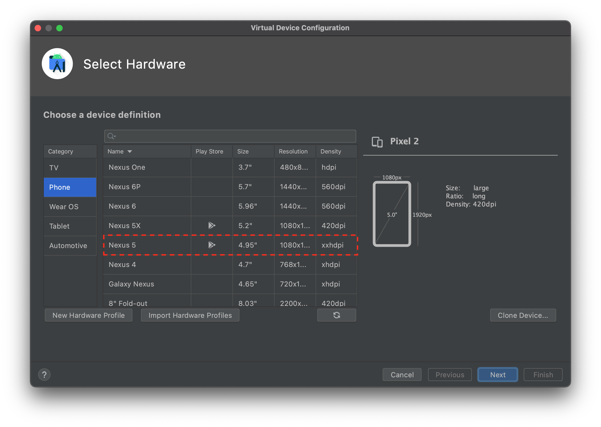
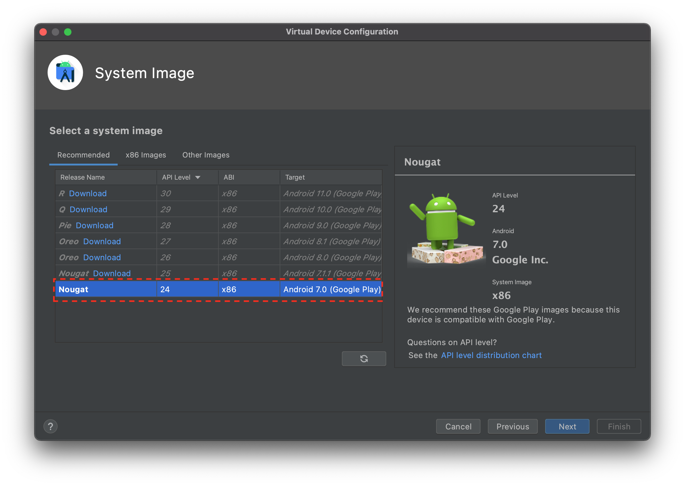
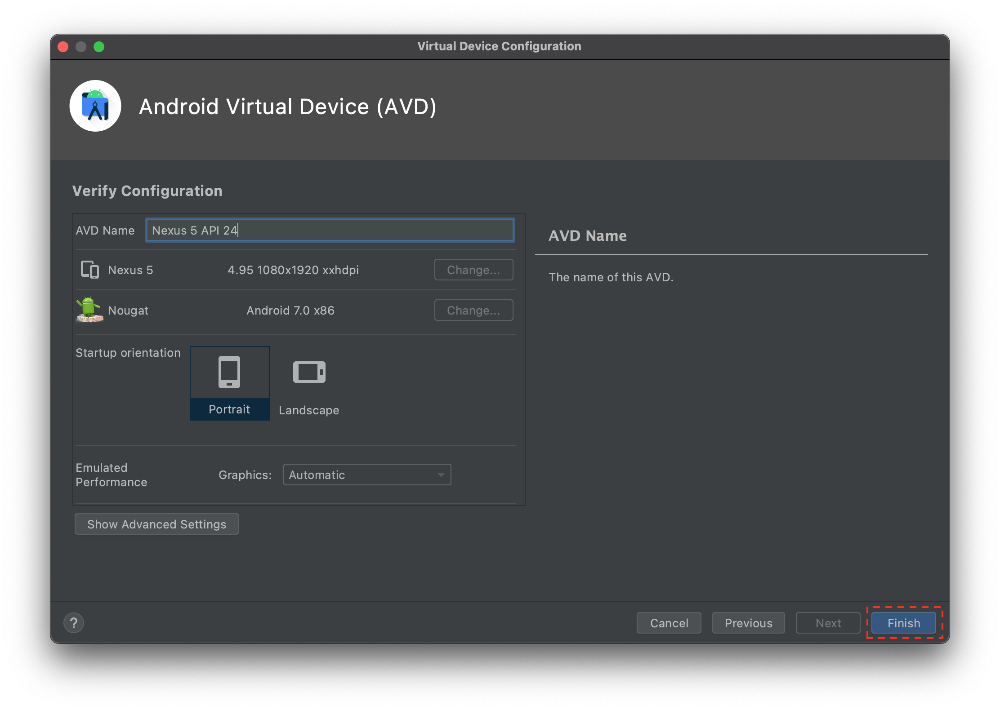
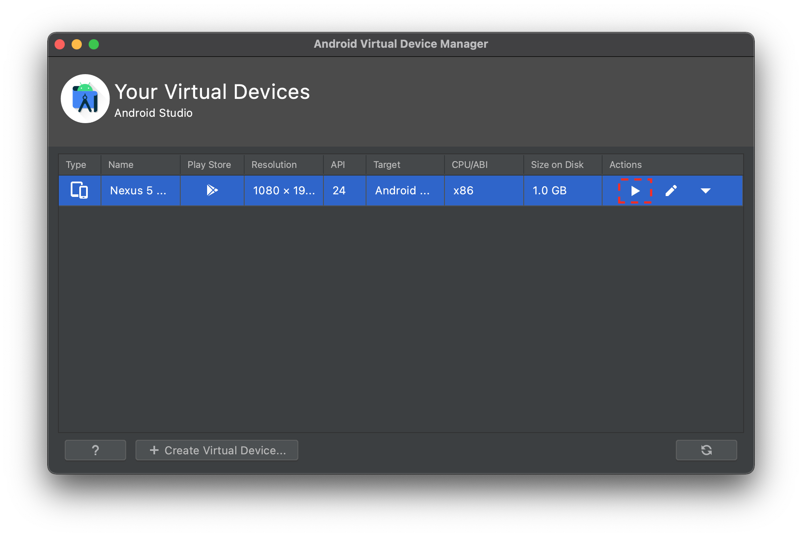

## Getting Started

Please follow these instructions before the tutorial begins to install [Android Studio](https://developer.android.com/studio) (the integrated development environment, or IDE, for building Android Apps) and configure an Android emulator (a virtual device that will allow you to run and test your prototype application).

### Installing Android Studio

Please visit [https://developer.android.com/studio](https://developer.android.com/studio) in order to download the version of Android studio for the operating system that you use. All major operating systems, including macOS, Windows, and most flavors of Linux are supported.

Follow the instructions for your specific operating system to finish the installation. You can find a detailed guide for specific operating systems [here](https://developer.android.com/studio/install).

### Configuring Your Android Emulator

Once you have installed Android studio, either navigate to the launch screen view or the code editor view in order to launch the **AVD Manager**. See the screenshots below to see the steps involved in doing this.

{ align=left }Click on AVD Manager to launch the configurator for the virtual Android Devices.

{ align=right }Click on AVD Manager to launch the configurator for the virtual Android Devices.

{ align=left }Click on AVD Manager to launch the configurator for the virtual Android Devices.

{ align=right }Click on AVD Manager to launch the configurator for the virtual Android Devices.

{ align=left }Click on AVD Manager to launch the configurator for the virtual Android Devices.

{ align=right }Click on AVD Manager to launch the configurator for the virtual Android Devices.

