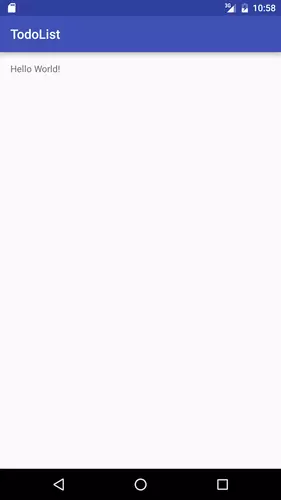

## Getting Started

Please follow these instructions before the tutorial begins to install [Android Studio](https://developer.android.com/studio) (the integrated development environment, or IDE, for building Android Apps) and configure an Android emulator (a virtual device that will allow you to run and test your prototype application).

### Installing Android Studio

Please visit [https://developer.android.com/studio](https://developer.android.com/studio) in order to download the version of Android studio for the operating system that you use. All major operating systems, including macOS, Windows, and most flavors of Linux are supported.

Follow the instructions for your specific operating system to finish the installation. You can find a detailed guide for specific operating systems [here](https://developer.android.com/studio/install).

### Configuring Your Android Emulator

Once you have installed Android studio, either navigate to the launch screen view or the code editor view in order to launch the **AVD Manager**. See the screenshots below to see the steps involved in doing this.

 1. First click on the "Configure" button at the bottom of the splash screen.

{ align=left }2. Click on the "AVD Manager" option to launch the configurator for the virtual Android Devices. 


 3. Click on the "+ Create Virtual Device" button to launch the configurator wizard.


 4. The first screen of the configurator wizard allows you to pick the hardware settings of your virtual Android device. This includes attributes such as the device screen size and pixel density. For the purposes of this tutorial, we will be using the Nexus 5 emulator, which you can select by scrolling to and clicking on the hardware configuration as shown in the above screenshot. After you have selected the Nexus 5 profile, you can click the "Next" button.


 5. Next we need to configure the software that our Android emulator will run on. The wizard allows you to select from many different Android versions, some of which contain proprietary Google Play APIs. For the purposes of this tutorial, we will be using Android 7.0 (also called Nougat) as it has good compatibility across a range of Android devices. To use this version, you first click on the Download button, to download the software image. After the download is complete, you can then select the software version in the configuration wizard and click the "Next" button.


 6. The Final screen of the configuration wizard provides some more advanced options and provides general information about the device you configured. For the purposes of this tutorial, we do not need to worry about advanced options, so you can simply click on the "Finish" button.


 7. Now that your Android emulator has been configured, you can launch the emulator by clicking on the green "play button as indicated above. This should launch your emulator and allow you to test applications! 

--- 

## Getting Help

If you have trouble or need help, please reach out to Dr. Moran on the `android-tutorial` channel in the [REU Slack](https://edm-reu-mason-2021.slack.com), or the [NRT Slack Channel](https://casbbinrt2021.slack.com). He will be happy to assist you!

---

## Tutorial: Developing a ToDo List App

Today, you will be developing a To-Do List application for Android using the Java programming language. While, as discussed in the lecture, Android does support Kotlin, most of you are likely more familiar with Java and it is still supported :-)

### Step 1: Create a New Android Studio Project


Open the AndroidStudio launch screen and select the "Create New Project" button.


Next select the "Empty Activity" and then click "Next".


On the next screen, you can configure the general project attributes. First, choose a suitable name for your TodoList project. You can use any name you like. Next, provide a package name. If you are not sure what to use, you can use `edu.gmu.<project-name>`. Next, select the location where you want the code to be stored on your computer hard-disk. After that, make sure that the selected Language is `Java` as we will be using Java for this tutorial. Next, set the minimum SDK to `API 24: Android 7.0 (Nougat)`. Make sure the "Use legacy android.support libraries is *unchecked*. Finally, click the "Finish" button to create your project!


Next, let's make sure your app can run! Once Android Studio finishes automatically setting up the new project, you can click on the green arrow in the menu bar to run your app. This should launch your configured emulator and launch the app!



### Step 2: Setting up the UI

In the `MainActivity.java` class, you should see something like the code below:

``` java linenums="1"
public class MainActivity extends AppCompatActivity {

    @Override
    protected void onCreate(Bundle savedInstanceState) {
        super.onCreate(savedInstanceState);
        setContentView(R.layout.activity_main);
    }
}
```

On line 11, you set the view of this activity to `R.layout.activity_main`, which points to a file called `activity_main.xml` in the `/res/layout` directory of the project. A view controls layout of the Android interface and looks like this:

``` xml linenums="1"
<?xml version="1.0" encoding="utf-8"?>
<RelativeLayout xmlns:android="http://schemas.android.com/apk/res/android"
    xmlns:tools="http://schemas.android.com/tools"
    android:layout_width="match_parent"
    android:layout_height="match_parent"
    android:paddingBottom="@dimen/activity_vertical_margin"
    android:paddingLeft="@dimen/activity_horizontal_margin"
    android:paddingRight="@dimen/activity_horizontal_margin"
    android:paddingTop="@dimen/activity_vertical_margin"
    tools:context="com.aziflaj.todolist.MainActivity">

    <TextView
        android:layout_width="wrap_content"
        android:layout_height="wrap_content"
        android:text="Hello World!" />
</RelativeLayout>
```

In the `main` view, you will add a `ListView`, which will contain a ToDo item in each row. To do this, replace the `TextView` element with the code below:

``` xml linenums="1"
<ListView
        android:id="@+id/list_todo"
        android:layout_width="wrap_content"
        android:layout_height="wrap_content"
        app:layout_constraintBottom_toBottomOf="parent"
        app:layout_constraintLeft_toLeftOf="parent"
        app:layout_constraintRight_toRightOf="parent"
        app:layout_constraintTop_toTopOf="parent" />
```