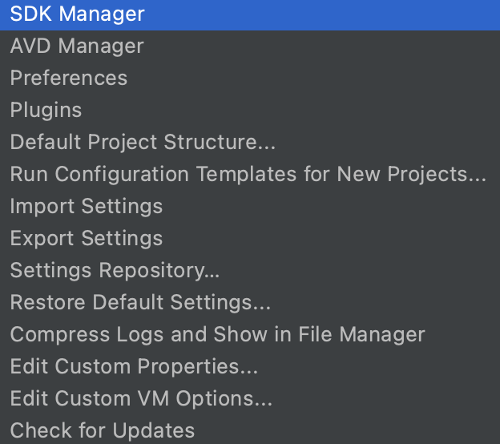
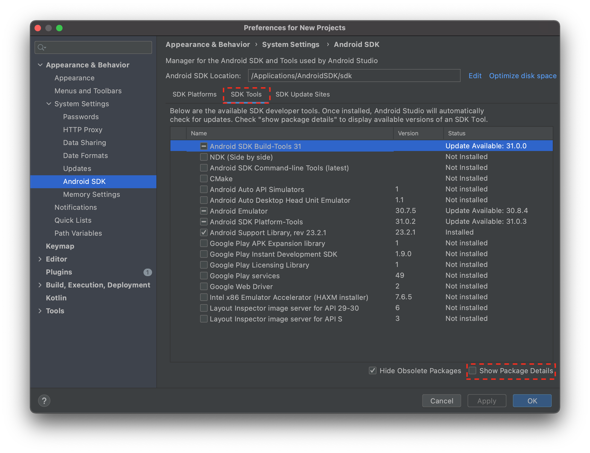
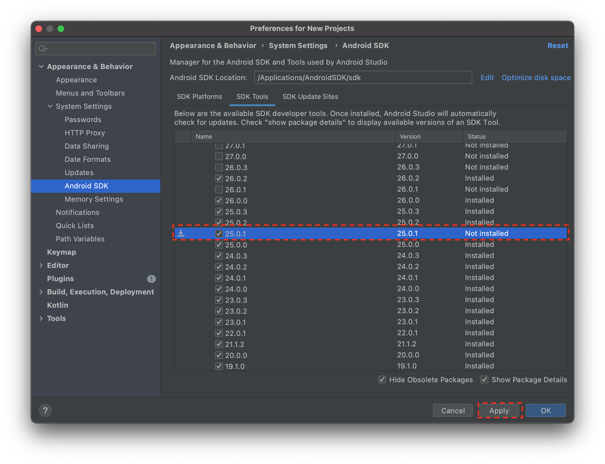
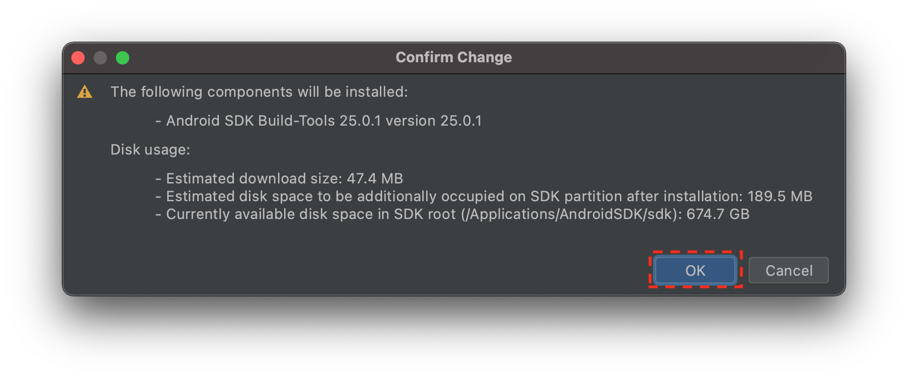
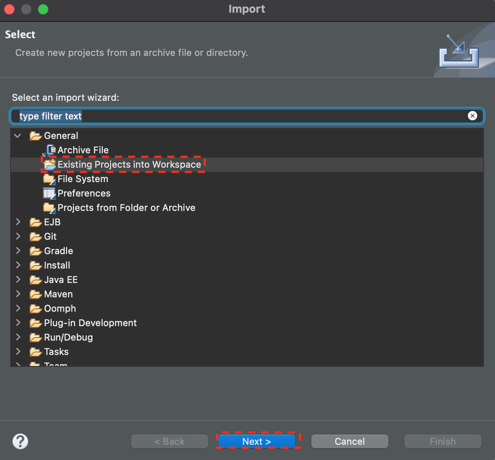
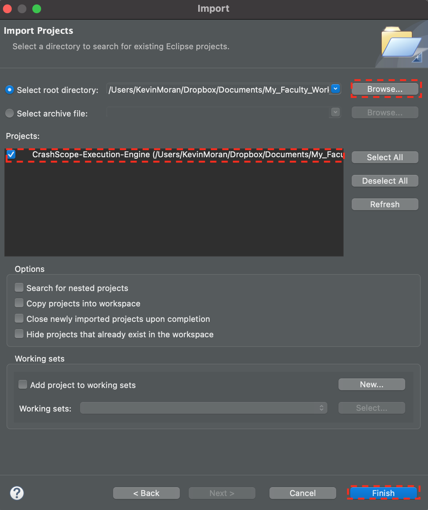

## Tutorial Materials

### <u>Tutorial Video</u>

Coming Soon!!


### <u>Tutorial Slides</u>

I will make the tutorial slides available after the presentation. Check back later to download.


<div style="text-align: center;">
<a href="" title="Click here to Download Tutorial Slides" class="md-button md-button--primary">Click Here to Download Tutorial Slides</a>
</div>

For additional technical information, you can download the CrashScope Tool Demo and Research Papers below:

<div style="text-align: center;">
<a href="https://arxiv.org/abs/1706.01130" title="Click here to Download CrashScope Research Paper" class="md-button md-button--primary">Click Here to Download CrashScope Research Paper</a>
</div>

<hr>

<div style="text-align: center;">
<a href="http://arxiv.org/abs/1801.06428" title="Click here to Download CrashScope Tool Demo Paper" class="md-button md-button--primary">Click Here to Download CrashScope Tool Demo Paper</a>
</div>

## Getting Started

Please follow these instructions before the tutorial begins to install [Android Studio](https://developer.android.com/studio) (the integrated development environment, or IDE, for building Android Apps) and configure an Android emulator (a virtual device that will allow you to run and test your prototype application).

### <u>Installing Android Studio</u>

Please visit [https://developer.android.com/studio](https://developer.android.com/studio) in order to download the version of Android studio for the operating system that you use. All major operating systems, including macOS, Windows, and most flavors of Linux are supported.

Follow the instructions for your specific operating system to finish the installation. You can find a detailed guide for specific operating systems [here](https://developer.android.com/studio/install).

### <u>Configuring Your Android Emulator</u>

Once you have installed Android studio, either navigate to the launch screen view or the code editor view in order to launch the **AVD Manager**. See the screenshots below to see the steps involved in doing this.

 1. First click on the "Configure" button at the bottom of the splash screen.

{ align=left }2. Click on the "AVD Manager" option to launch the configurator for the virtual Android Devices. 


 3. Click on the "+ Create Virtual Device" button to launch the configurator wizard.


 4. The first screen of the configurator wizard allows you to pick the hardware settings of your virtual Android device. This includes attributes such as the device screen size and pixel density. For the purposes of this tutorial, we will be using the Nexus 5 emulator, which you can select by scrolling to and clicking on the hardware configuration as shown in the above screenshot. After you have selected the Nexus 5 profile, you can click the "Next" button.


 5. Next we need to configure the software that our Android emulator will run on. The wizard allows you to select from many different Android versions, some of which contain proprietary Google Play APIs. For the purposes of this tutorial, we will be using Android 7.0 (also called Nougat) as it has good compatibility across a range of Android devices. To use this version, you first click on the Download button, to download the software image. After the download is complete, you can then select the software version in the configuration wizard and click the "Next" button.


 6. The Final screen of the configuration wizard provides some more advanced options and provides general information about the device you configured. For the purposes of this tutorial, we do not need to worry about advanced options, so you can simply click on the "Finish" button.


 7. Now that your Android emulator has been configured, you can launch the emulator by clicking on the green "play button as indicated above. This should launch your emulator and allow you to test applications! 

### <u>Downloading the Android Build Tools</u>

In order to properly run CrashScope, you will need to download a set of the Android build tools that allow for automated extraction of app information from apks.


 1. First, while at the splash Screen of Android Studio click on the "configure" button.

 2. Next Click on the **SDK Manager** menu option.

 3. Next, in the new screen that pops up, click on the **SDK Tools** Tab and then click on the **Show Package Details** button in the bottom left.

 4. Next, you will need to scroll until you come across the Build Tools version `25.0.1`. Click the check next to this option and then click the **Apply** button.

 5. Finally, click the **OK** button on the confirmation popup that appears. You have now installed the build tools required by CrashScope.


---

## Tutorial: Executing a Test Application with CrashScope

Today, you will be executing a test application using the CrashScope tool. To do this, you will first need to clone the CrashScope Repo, which you can find by clicking the button below. Once you have cloned the project, you can import it into the Eclipse IDE (see note below). 


!!! note
    This tutorial is centered around using Eclipse, however, if you are experienced in setting up Java projects in other IDEs feel free to use your IDE of choice.
    

### <u>Step 1: Clone the CrashScope Project & Libraries</u>

First you will need to clone the CrashScope GitHub repo. You can access the repo by using the link below.

<div style="text-align: center;">
<a href="https://github.com/SageSELab/CrashScope" title="Click here to Access the GitHub project" class="md-button md-button--primary">Click Here to Access the GitHub project</a>
</div>

Next, you will need to download the libraries required to run CrashScope (offered as a separated download due to licensing constraints). You can download the required libraries below. Simply download this and unpack them at the root of the CrashScope repo. The folder should named `lib`.

<div style="text-align: center;">
<a href="../files/lib.zip" title="Click here to Download the CrashScope Libraries" class="md-button md-button--primary">Click here to Download the CrashScope Libraries</a>
</div>

Finally, you will need to download a test application to run with CrashScope. We will be using the *Mileage* application in this tutorial. You can download the Mileage `.apk` file by clicking the button below.

<div style="text-align: center;">
<a href="../files/mileage.apk" title="Click here to Download the Test App" class="md-button md-button--primary">Click here to Download the Test App</a>
</div>

Once, you have downloaded the Mileage application, put it in the root of the cloned CrashScope repository.

### <u>Step 2: Importing CrashScope into Eclipse</u>


First, if you have not done so already, download Eclipse from the [Eclipse Project Page](https://www.eclipse.org/downloads/), and follow the instructions for installing the IDE on your respective personal computer.

Next, you will need to import the project into Eclipse. To do this, click on the Eclipse's **File** menu, and then click on the **Import Project** option.

 You should then see the screen above. Select the **Existing Projects into Workspace** option and then click **Next**. 

 On the next screen you should click the **Browse** button to locate the folder where the CrashScope repo was cloned. Then once you have selected that folder, be sure the **CrashScope-Execution-Engine** project is selected, and click on the **Finish** button. 

This should import CrashScope into Eclipse where you can start to use/run it. 

### <u>Step 2: Configuring CrashScope</u>

In the `CrashScope.java` class (located in the `edu.semeru.android.testing` package), you should see something like the code below in the `main` method:

``` java linenums="1"
        // TO BE CONFIGURED
        // This should be a path to a text file that contains a list of apk paths to be run. 
        // Each line should consist of a path to a given apk file.
        String apkFile = "apps.txt";
        
        
        // TO BE CONFIGURED
        // This path should point to the aapt tool that is included with the Android SDK.
        // The current version of CrashScope was tested with version 25.0.1
        String aaptPath = "AndroidSDK/sdk/build-tools/25.0.1";
        
        
        // TO BE CONFIGURED
        // This path should point to an empty folder where CrashScope will store some
        // both temporary data generated during execution, and the final output 
        // execution json files.
        String dataFolder = "CrashScope-Data/";
```

The first thing you will need to do is replace these paths with the corresponding paths on your own personal computer according to the provided documentation. 

!!! note
    Be sure that you add the **full path** of the Mileage application to the first line of the `apps.txt` file, so that CrashScope knows where to find the app.

Additionally, in the same class, in the `runCrashScopeLocal` method you will see the following:

``` java linenums="1"
        // TO BE CONFIGURED
        // This is the path the scripts folder in the crashscope execution engine project.
        // Should be updated to the appropriate path once you clone the project.
        String scriptsPath = "crashscope-execution-engine/scripts";
      
        // TO BE CONFIGURED
        // This is the path to the root of your Android SDK folder.
        // CrashScope uses various tools included with the Android SDK to ineract with devices and emualtors.
        String androidSDKPath = "/Applications/AndroidSDK/sdk";
              

        // These are the default emulator paths for most systems.
        // These should only be updated if you are using a non-default emulator path.
        String avdPort = "5554";
        String adbPort = "5037";
```

You will also need to do is replace these paths with the corresponding paths on your own personal computer according to the provided documentation.

### <u>Step 2: Running CrashScope</u>

Now that you have configured all the relevant paths, it is time to run CrashScope on the Mileage app!

 Launch your configured emulator by clicking on the green start button in the Android Studio AVD manager. (Refer to the setup instructions for additional details).

Next, you will need to run the `main` method in the `CrashScope.java` file. To do this, Right click the `CrashScope.java` file in the Eclipse File explorer, and then select **Run as** -> **Java Application**. 

This will start the Execution of CrashScope on the Mileage application!


---

### <u>Final Step: Congratulations!</u>

Congrats on running your first app with CrashScope. You will find the output of the technique in your `CrashScope-Data` folder, which will include screenshots of each step, as well as a .json file that contains all of the information for a given execution.

We hope that future researchers will build upon CrashScope for AR/VR/XR applicaitons by replacing the `uiautomator` interface, which fetches information regarding native Android app GUIs, with Computer Vision techniques that can reliably detect various interface components for AR/VR/XR applications.

